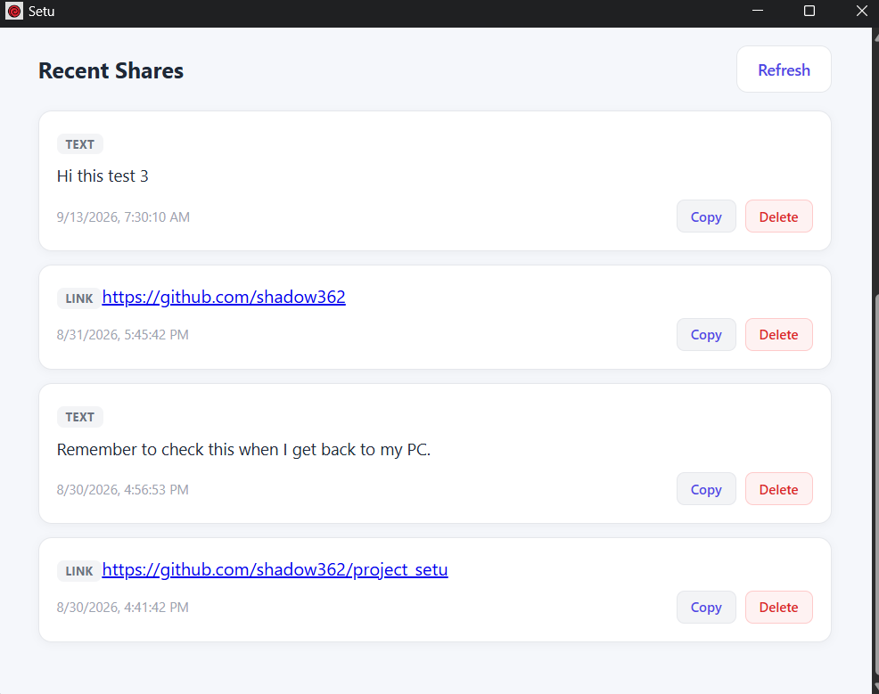

# Setu

> A simple desktop app for sharing text and links through a focused, lightweight interface.

Setu is an open-source project built around a simple idea: make it easy to save and move useful information between devices without relying on complicated workflows.

The current version is a desktop MVP built with Tauri, React, TypeScript, FastAPI, and SQLite.



---

## Features

- Share text through a simple desktop interface
- Automatically detect links
- Open shared links directly in the browser
- Copy shared content to the clipboard
- Delete individual shares
- Manually refresh recent shares
- Automatically refresh shares every 5 seconds
- Loading state while sharing
- Backend connection error handling
- Lightweight desktop application using Tauri

---

## Tech Stack

### Desktop

- Tauri
- React
- TypeScript
- Vite

### Backend

- Python
- FastAPI
- SQLAlchemy
- SQLite
- REST API

---

## Architecture

```text
┌─────────────────────┐
│     Setu Desktop    │
│   Tauri + React     │
│    TypeScript       │
└──────────┬──────────┘
           │
           │ REST API
           ▼
┌─────────────────────┐
│    FastAPI Backend  │
│       Python        │
└──────────┬──────────┘
           │
           ▼
┌─────────────────────┐
│       SQLite        │
│      Database       │
└─────────────────────┘